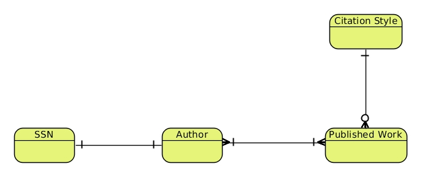
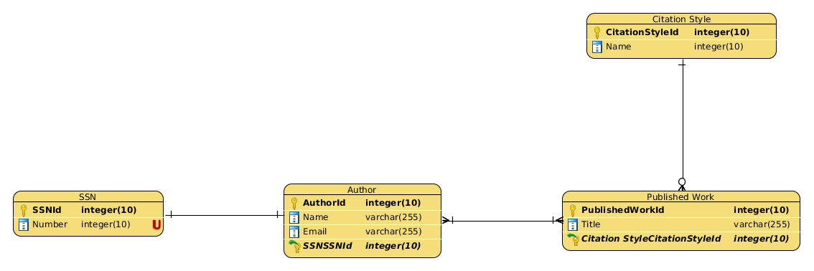
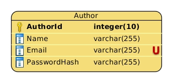
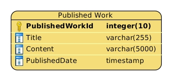

class: center, middle

# Models, Attributes and Code

---

## Goals

- Finding model attributes
- Adding Attributes to ERDs
- Representing models in C#

---

## Entity Relationship Diagram

ERDs have 3 forms:

--

- Conceptual: Focuses on entities relationships

--

- Logical: Contains relationships and model attributes

--

- Physical: Nearly identical representation of a physical database schema

---

## Conceptual ERD

.center[]

--

Serves as a good start of designing a database.

---

## Logical ERD

An ERD where the columns names and types are defined for each Entity.

.sized[]

---

## Attributes

.larger[Characteristics of a model or entity.]

--

.larger[But there's so many, how do we choose the right ones?]

---

## Intrinsic & Extrinsic States

- Instrinsic - part of entity's makeup or identity

--

- Extrinsic - a characteristic resulting from of an interaction with an external actor

---

## Intrinsic & Extrinsic States

.larger[Examples of Instrinsic]

- mass
- height
- name or title

--

.larger[Examples of Extrinsic]

- weight
- usefulness
- permissions/authorization

---

## Attributes

1. Have a problem set/scope

1. Identify Intrinsic characterisics that describe the entity in the most basic sense

--

1. Give the Intrinsic characteristics descriptive names

--

1. For each attibute, identify the likely datatypes. Be able to justify.

--

1. Add the attributes to your ERD

---

## Identifying Attributes: Author

.center.larger[Problem: We're building an online authoring system.]

--

Authors need to be able to:

- login

--

- upload published posts

--

- have their name shown on their publication

---

## Identify Attributes: Author & Published Work

.center.larger[Problem: We're building an online authoring system.]

--

.center[]

.center.larger[Problem: We're building an online authoring system.]

--

.center.larger[What intrinsic characteristics are required to allow Authors to **login**? Discuss.]

---

## Identify Attributes

.center.larger[**Author & Published Work**]

.center[Problem: We're building an online authoring system.]

--

.center[What intrinsic characteristics are required to allow Authors to **have their name on their publication**? Discuss.]

---

## Identify Attributes

.center.larger[**Author & Published Work**]

.center[Problem: We're building an online authoring system.]

--

.center[What intrinsic characteristics are required to allow Authors to **upload a work**? Discuss.]

--

.center[(Think: What makes a Published Work?)]

---

## Identify Attributes

.center.larger[**Author & Published Work**]

.center[]

--

.center[]

---

class: center, middle

## Full Example: Trello

---

## From ERDs to Code

Things to know:

1. Models/Entities are objects in C# as concrete classes

--

1. Attributes are properties

--

1. Relationships are C# collections or simple references

